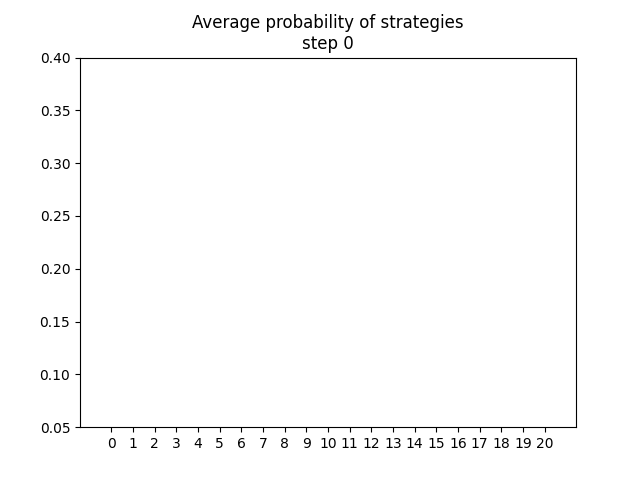

# CFR Simultaneous

Attempt to work through An Introduction to Counterfactual Regret Minimization of Todd W. Neller and Marc Lanctot.

## Compilation

```shell
make build
```

## Usage

### Examples

To run examples of CRF using default values

#### Rock-Paper-Scissor

To compute the average mixed strategies for both player in a RPS game:

```shell
make run_rps
```

#### Colonel Blotto

To compute the average mixed strategies for both player in a Colonel Blotto game:

```shell
make run_blt
```

### More general case

The executable is located in `.\build\bin\main`.

```txt
Usage:
    main RPS [seed N]           # Run Rock-Paper-Scissor
    main Blotto [seed N B S]    # Run Colonel Blotto

Options:
    seed                        Seed used
    N                           Number of Monte-Carlo Steps
    B                           Number of battlefields (Blotto only)
    S                           Number of soldiers (Blotto only)
```

## Visualization

A python script is included to visualize the convergence of the Monte-Carlo algorithm towards an average mixed strategy. It will create a gif using the iterated average strategies of player 1 during the Monte-Carlo algorithm. The exported data are located in `export_avg_strategy.csv` and the produced gif in `average_strategies.gif`.

### Installation

```shell
make install
```

### Execution

```shell
make anim
```

### Example

For a Colonel Blotto with 3 battlefields and 5 soldiers using a seed of 20, we have the following average strategies:



## Note concerning strategy indeces

Internally a strategy is encoded using a combinatorial number system. For instance the strategy `0` for a Blotto with 3 battlefields and 5 soldiers represents:

- 5 soldiers in the battlefield 0
- 0 soldiers in the battlefield 1
- 0 soldiers in the battlefield 2
